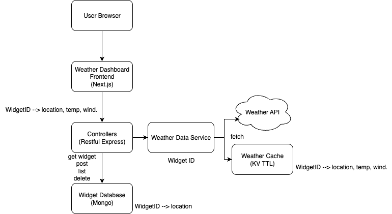

## 📦 Projektstruktur (Vorschlag)

```txt
/project-root
├── frontend/         → Next.js Frontend (Dashboard)
│   ├── pages/
│   ├── components/
│   └── utils/
├── backend/          → Node.js Backend (Express oder Fastify)
│   ├── routes/
│   ├── controllers/
│   ├── models/
│   ├── services/     → Wetterdaten-Logik inkl. Caching
│   └── cache/        → optional: In-Memory oder File-basierter Cache
└── README.md
```

---

## 🧭 Systemarchitektur



Die Grafik zeigt die Hauptkomponenten und deren Zuordnung im Code:

- User Browser → Weather Dashboard Frontend (Next.js)
  - Code: `frontend/`, Startseite `frontend/pages/index.js`
  - Aufgaben: Widgets anzeigen/anlegen/löschen; pro Widget alle 60s aktualisieren
  - Backend‑Basis: `NEXT_PUBLIC_API_BASE` (lokal `http://localhost:5050`, Compose via Rewrite `/api`)

- Controllers (Restful Express)
  - Code: `backend/src/controllers/widgetsController.js`
  - Routen: `backend/src/routes/widgets.js`, `backend/src/routes/weather.js`
  - Aufgabe: Validierung, Orchestrierung von DB und Service, Fehlerabbildung

- Weather Data Service
  - Code: `backend/src/services/weatherService.js`
  - Aufgabe: Geocoding + Forecast über Open‑Meteo, Vereinheitlichung der Antwort
  - Sprache Geocoding: `de`, Timeout: 5s, Read‑Through‑Cache

- Weather Cache (KV TTL)
  - Code: `backend/src/cache/memoryCache.js`
  - In‑Process Map mit TTL (5 Minuten) je Ort, reduziert Upstream‑Aufrufe

- Widget Database (Mongo)
  - Code: `backend/src/models/Widget.js`, Verbindung `backend/src/db.js`
  - Inhalt: `location`, `createdAt`

- Weather API (Open‑Meteo)
  - Geocoding: `https://geocoding-api.open-meteo.com/v1/search`
  - Forecast: `https://api.open-meteo.com/v1/forecast`

### Datenflüsse
1) Widget anlegen
   - FE → BE: `POST /widgets { location }` → Mongo speichert → `201 Created`
2) Wetter je Widget (mit Cache)
   - FE → BE: `GET /widgets/:id/weather` → Widget lesen → Cache‑Hit: direkt; Miss: Geocode → Forecast → Cache → `200 OK`
3) Direkte Ortssuche
   - FE → BE: `GET /weather?location=Berlin` → Read‑Through wie oben → `200 OK`

### Ports & Umgebungen
- Frontend `3000`, Backend `5050`, Mongo `27017`, Mongo‑Express `8081`
- Frontend: `NEXT_PUBLIC_API_BASE` (lokal `http://localhost:5050`, Compose `/api`)
- Backend: `MONGODB_URI` (lokal `mongodb://localhost:27017/widgets`, Compose `mongodb://mongo:27017/widgets`)

### Fehlertexte (vereinheitlicht)
- 400: Ort fehlt → `Ort fehlt`
- 404: Widget nicht gefunden → `Widget nicht gefunden`
- 404: Ort nicht gefunden → `Ort nicht gefunden`
- 502: Wetterdaten nicht verfügbar → `Wetterdaten nicht verfügbar`
- 500: Interner Serverfehler (Fallback)

## 🚀 Setup-Anleitung

### Voraussetzungen:
- Node.js (v18+ empfohlen)
- MongoDB (lokal oder über MongoDB Atlas)
- NPM oder Yarn

> Falls `npm`/`yarn` lokal nicht verfügbar ist, können Sie die Apps auch in Docker starten (siehe unten).

### 1. Backend starten

```bash
# Ins Backend wechseln
cd backend

# Abhängigkeiten installieren
npm install

# Entwicklungsserver starten
npm run dev
```

> 💡 Beispiel `.env`-Datei:
```env
MONGODB_URI=mongodb://localhost:27017/widgets
PORT=5000
```

> Alternativ: Docker (Backend)
```bash
docker run --rm -p 27017:27017 --name mongo mongo:7
# neues Terminal
cd backend
cp .env.example .env  # stellen Sie sicher, dass MONGODB_URI auf localhost:27017 zeigt
npm install && npm run dev
```

---

### 2. Frontend starten

```bash
# Ins Frontend wechseln
cd frontend

# Abhängigkeiten installieren
npm install

# Entwicklungsserver starten
npm run dev
```

> 💡 Standardmäßig läuft das Frontend unter `http://localhost:3000`  
> 💡 Das Backend sollte unter `http://localhost:5050` erreichbar sein

> Optional per Docker (Frontend)
```bash
cd frontend
npm install
npm run build && npm start
```

### 3. Datenbank (MongoDB)

Sie können MongoDB lokal installieren oder per Docker Compose starten:

```bash
# Docker Compose (MongoDB + mongo-express UI)
docker compose up -d mongo mongo-express

# mongo-express UI
# http://localhost:8081
```

Verbindung vom Backend (Standard):

```env
MONGODB_URI=mongodb://localhost:27017/widgets
```

Falls Sie das Backend innerhalb von Docker laufen lassen, verwenden Sie:

```env
MONGODB_URI=mongodb://mongo:27017/widgets
```

---

## 🐳 Docker: Schnellstart

```bash
cd /Users/guyuqiang/PKF/Tecomon-Aufgabe-fork
docker compose up -d --build

# Dienste:
# Frontend: http://localhost:3000
# Backend:  http://localhost:5050/health
# Mongo:    localhost:27017
# UI:       http://localhost:8081
```

Compose baut und startet MongoDB, Backend, Frontend und mongo-express. 
Das Frontend greift über `NEXT_PUBLIC_API_BASE=/api` (Rewrite) auf das Backend zu. 
Das Backend verbindet sich über `MONGODB_URI=mongodb://mongo:27017/widgets` mit der Datenbank.

---

## 🔍 Funktionale Anforderungen

### 🔹 Dashboard (Frontend)
- Benutzer kann mehrere Widgets erstellen, z. B. für:
  - Wetter in Berlin
  - Wetter in Hamburg
  - Wetter in Paris
- Jedes Widget zeigt live die Wetterdaten für den gewählten Ort
- Widgets können gelöscht werden
- Keine Authentifizierung notwendig

### 🔹 Backend (API + MongoDB)
- API zum Erstellen, Abrufen und Löschen von Widgets
- MongoDB speichert:
  - Widget-Daten (`_id`, `location`, `createdAt`)
  - (Optional: Benutzer-ID, falls später Auth hinzukommt)

### 🔹 Wetterdaten-Handling
- Wetterdaten werden bei Bedarf vom Backend über einen externen Wetterdienst abgerufen (z. B. open-meteo oder OpenWeather)
- Wenn für eine Stadt in den letzten **5 Minuten** bereits ein Abruf erfolgte, wird der **cached** Wert zurückgegeben (Memory oder einfache Cache-Datei)

---

## 🧾 API-Vorschlag

| Methode | Endpoint                 | Beschreibung                       |
|---------|--------------------------|------------------------------------|
| GET     | `/widgets`               | Liste aller gespeicherten Widgets |
| POST    | `/widgets`               | Neues Widget erstellen (`location`) |
| DELETE  | `/widgets/:id`           | Widget löschen                     |

Zusätzliche Endpoints:
- **GET** `/widgets/:id/weather` → Live-Wetter für ein Widget (mit 5‑Minuten Cache)
- **GET** `/weather?location=Berlin` → Direktabfrage nach Ort (mit Cache)

---

## ☁️ Wetterdaten-API

Kostenlose APIs zur Auswahl:

- [https://open-meteo.com/](https://open-meteo.com/) (kein API-Key nötig)
- [https://openweathermap.org/api](https://openweathermap.org/api) (kostenlos, mit Key)

---

## 🧪 Ziel des Projekts

- Verständnis für API-Design, Next.js-Frontend und Microservice-Architektur
- Umgang mit externen APIs und Caching
- MongoDB-Datenmodellierung
- Trennung von Backend-Logik und Frontend-Komponenten
- saubere Code-Struktur, Modularität und Dokumentation

---

## 📄 Was soll eingereicht werden?

- `README.md` mit:
  - Setup-Anleitung
  - API-Beschreibung
  - Kurzer Architekturüberblick (z. B. mit Text oder Diagramm)
