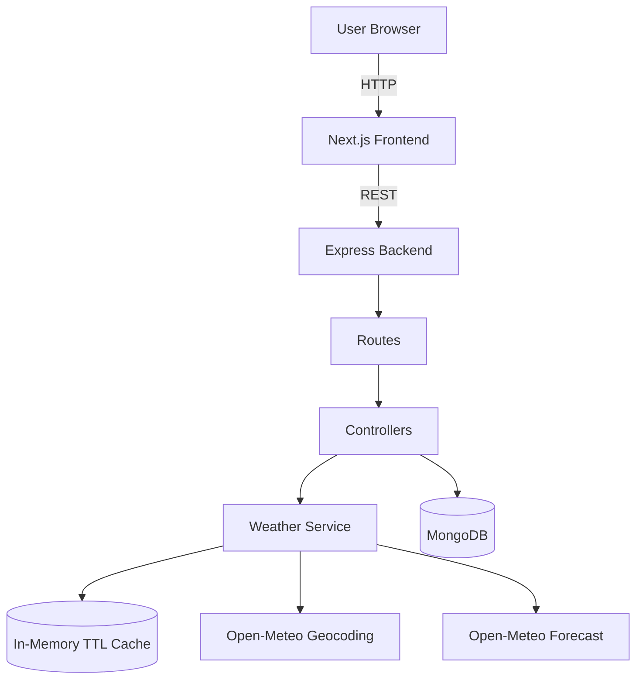
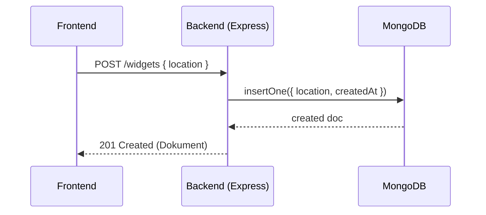
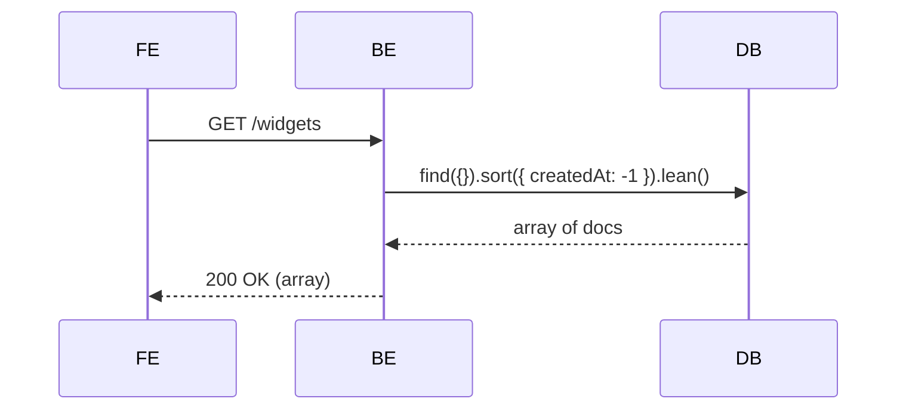
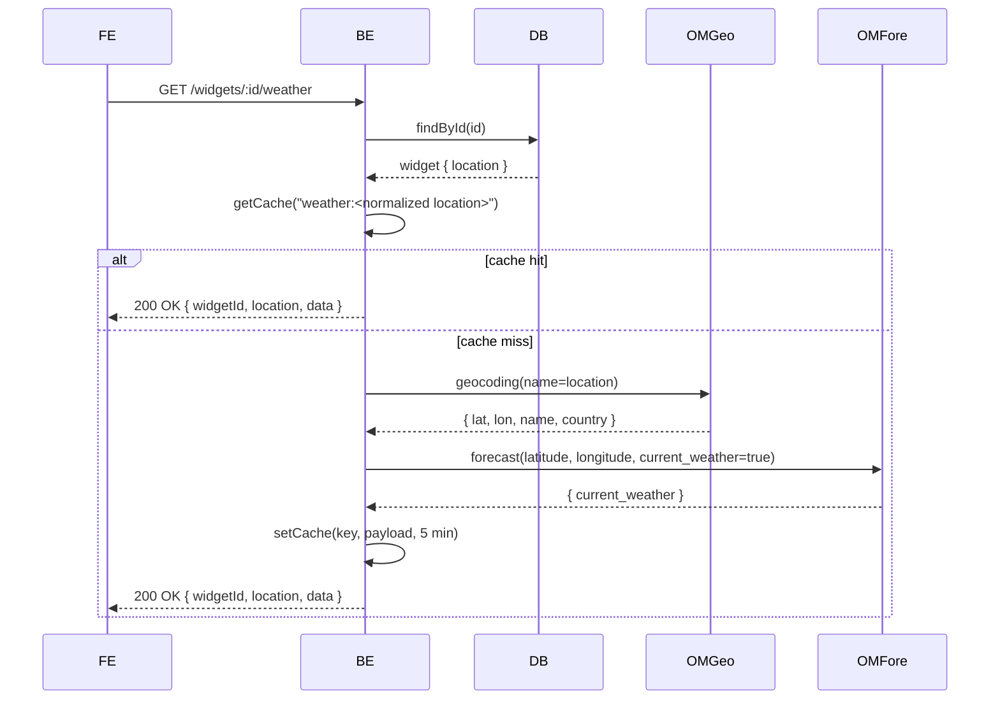
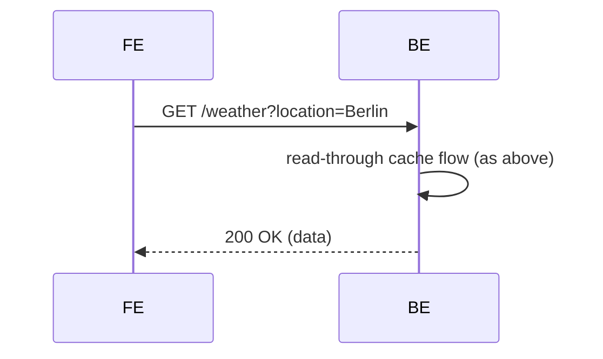

### Systemdesign – Tecomon Wetter-Widgets

#### Überblick
- **Zweck**: Wetter-Dashboard, in dem Nutzer Widgets pro Ort anlegen und aktuelle Wetterdaten sehen.
- **Technologie-Stack**: Next.js 14 Frontend; Node.js + Express Backend; MongoDB; In‑Process TTL‑Cache; Open‑Meteo als externer Dienst.

#### Ziele & Nicht‑Ziele
- **Ziele**: Einfaches CRUD für Widgets, niedrige Latenz bei aktuellen Wetterdaten, minimaler Setup‑Aufwand, klare Schichten.
- **Nicht‑Ziele**: Historische Wetterdaten, Authentifizierung/Autorisierung, Mandanten‑Isolation, hochverfügbarer Cache.

#### Architektur (High‑Level)
- **Frontend (Next.js 14)**
  - `pages/index.js` rendert Widgets und ruft das Backend über `NEXT_PUBLIC_API_BASE` auf.
  - Polling pro Widget alle 60 Sekunden zur Aktualisierung der Wetterdaten.
- **Backend (Express)**
  - Routen: `routes/widgets.js`, `routes/weather.js`.
  - Controller: `controllers/widgetsController.js` für Validierung/Orchestrierung.
  - Services: `services/weatherService.js` kombiniert Geocoding + Forecast + Caching.
  - Cache: `cache/memoryCache.js` In‑Process Map mit per‑Key TTL (5 Minuten).
  - Daten: `models/Widget.js` (Mongoose) und `db.js` Verbindungs‑Bootstrap.
  - App: `server.js` konfiguriert CORS, JSON, Logging, Health, 404, Error‑Handler.
- **Datenbank**: MongoDB (Collection `widgets`).
- **Externe Dienste**: Open‑Meteo Geocoding API + Forecast API.
- **Deployment**: Docker Compose (Frontend, Backend, Mongo, Mongo‑Express) oder lokale Entwicklung.

#### Architekturdiagramm


#### Ablaufansichten (wichtige Flows)
- Widget erstellen

- Widgets auflisten

- Wetter pro Widget (Cache Read‑Through)

- Wetter per Query


#### Datenmodell
- **Widget** (Collection `widgets`)
  - Felder: `location: string (required, trimmed)`, `createdAt: Date`.
  - Mongoose: `timestamps: { createdAt, updatedAt: false }`, `versionKey: false`.
  - Beispiel‑Dokument:
```json
{
  "_id": "66f0c1...",
  "location": "Berlin",
  "createdAt": "2025-09-18T08:10:30.000Z"
}
```
  - Indizes: für aktuelle Flows nicht erforderlich; erwäge `{ createdAt: -1 }` und optional `{ location: 1 }` für spätere Ortssuchen.

#### API‑Verträge
- Konventionen
  - Content‑Type: `application/json`.
  - Fehlerformat: `{ "error": string }` mit passendem HTTP‑Status.

- Widgets
  - GET `/widgets`
    - 200 OK: `Array<Widget>`
  - POST `/widgets`
    - Body: `{ "location": string }`
    - 201 Created: `Widget`
    - 400: `{ error: "Ungültiger Ort" }`
  - DELETE `/widgets/:id`
    - 204 No Content
    - 404: `{ error: "Widget nicht gefunden" }`
  - GET `/widgets/:id/weather`
    - 200 OK: `{ widgetId: string, location: string, data: WeatherPayload }`
    - 404: `{ error: "Widget nicht gefunden" }`

- Weather
  - GET `/weather?location=<name>`
    - 200 OK: `WeatherPayload`
    - 400: `{ error: "Ort fehlt" }`
    - 404: `{ error: "Ort nicht gefunden" }`
    - 502: `{ error: "Wetterdaten nicht verfügbar" }`

- Types
```json
// WeatherPayload
{
  "location": "Berlin",
  "country": "Germany",
  "temperature": 12.7,
  "windspeed": 19.8,
  "weathercode": 3,
  "time": "2025-09-18T08:15:00Z"
}
```

#### Validierungsregeln
- `POST /widgets`: `location` muss ein nicht‑leerer String sein; Backend trimmt.
- `GET /weather` und Service‑Schicht: `location` erforderlich; Normalisierung (lower case) für Cache‑Keys.

#### Caching‑Strategie
- **Keying**: `weather:<normalizedLocation>`, Normalisierung = `String(location).trim().toLowerCase()`.
- **TTL**: 5 Minuten pro Key (`FIVE_MINUTES_MS`).
- **Read‑Through**: Bei Miss Geocode → Forecast ausführen, dann in Cache legen und zurückgeben.
- **Scope**: In‑Process `Map` pro Backend‑Instanz. Eviction bei Ablauf oder Neustart.
- **Konsistenz**: Eventual Consistency innerhalb der TTL. Bis zu 5 Min veraltete Daten möglich.
- **Stampede**: Aktuell nicht mitigiert; Request‑Coalescing/Single‑Flight erwägen.
- **Skalierung**: Für >1 Instanz Redis/Memcached für Shared Cache nutzen.

#### Zuverlässigkeit & Fehlerbehandlung
- **Externe Timeouts**: Axios 5s Timeout für Geocoding und Forecast.
- **Fehlermapping** (aus dem Service):
  - 400 `Ort fehlt` bei leerer Eingabe.
  - 404 `Ort nicht gefunden` wenn Geocoding keine Ergebnisse liefert.
  - 502 `Wetterdaten nicht verfügbar` wenn `current_weather` fehlt.
  - 500 Standard über Error‑Middleware für unbehandelte Fehler.
- **Health**: `GET /health` → `{ status: 'ok' }` als Liveness‑Probe.
- **Empfehlungen**: Retries mit Backoff für temporäre 5xx, Circuit Breaker, Upstream‑Fehlertelemetrie.

#### Sicherheit
- **CORS**: Allowlist `http://localhost:3000` und `http://127.0.0.1:3000`; Methoden `GET, POST, DELETE, OPTIONS`; Header `Content‑Type`.
- **Input‑Härtung**: Basis‑Typprüfung und Trim; strengere Validierung und Längenlimits erwägen.
- **Rate Limiting**: Nicht implementiert; empfohlen pro IP für `/weather` und Widget‑Wetter.
- **Secrets**: Keine externen API‑Keys nötig (Open‑Meteo). Mongo‑URI in Env halten.

#### Konfiguration & Umgebungen
- Backend Env
  - `MONGODB_URI` Standard `mongodb://localhost:27017/widgets` (Compose: `mongodb://mongo:27017/widgets`).
  - `PORT` Standard `5050`.
- Frontend Env
  - `NEXT_PUBLIC_API_BASE` Standard `http://localhost:5050` (Compose: `/api`).
  - `BACKEND_INTERNAL_PORT` Standard `5050` für Next.js Rewrite‑Ziel.
- Ports
  - Frontend 3000, Backend 5050, Mongo 27017, Mongo Express 8081.

#### Deployment
- Lokale Entwicklung
  - Backend: `cd backend && npm install && npm run dev` (nodemon).
  - Frontend: `cd frontend && npm install && npm run dev`.
  - Mongo: lokal installieren oder `docker run -p 27017:27017 mongo:7`.
- Docker Compose
  - `docker compose up -d --build` im Repo‑Root.
  - Zugriff: Frontend `http://localhost:3000`, Backend `http://localhost:5050/health`, Mongo Express `http://localhost:8081`.
  - Next.js `output: 'standalone'` für kleines Production‑Image.

#### Observability
- **Logging**: `morgan('dev')` für Request‑Logs; strukturierte JSON‑Logs für Produktion empfohlen.
- **Metriken (Vorschlag)**: Request‑Latenz, Fehlerraten pro Route, Cache‑Hit‑Ratio, Upstream‑Dauern, TTL‑Expirations.
- **Tracing (Vorschlag)**: OpenTelemetry‑Instrumentierung über Express und Axios (Geocode/Forecast Calls).
- **Dashboards/Alerts (Vorschlag)**: Alarm bei sinkender Cache‑Hit‑Ratio, Upstream‑5xx‑Spikes, Backend‑Fehlerrate, erhöhter Latenz.

#### Performance‑Überlegungen
- Cache‑TTL reduziert Upstream‑Aufrufe und p95‑Latenz bei Wiederholungen.
- Node/Express‑Overhead gering; Axios‑Timeouts begrenzen externe Latenz.
- Frontend‑Polling alle 60s pro Widget; bei Skalierung Exponential Backoff oder Server‑Push (SSE/WebSocket) erwägen.

#### Skalierbarkeit
- Backend zustandslos abgesehen vom In‑Process‑Cache. Horizontale Skalierung benötigt Shared Cache zur Hit‑Rate‑Wahrung.
- Datenbank Single‑Instance in Compose; für Produktion Managed Mongo nutzen und Indizes ergänzen.
- CDN für Frontend‑Assets; Next.js kann horizontal hinter einem Load Balancer skalieren.

#### Teststrategie (Vorschlag)
- Unit: `weatherService` mit HTTP‑Mocking (nock/msw) für Geocoding/Forecast; Cache Hit/Miss Logik.
- API: Supertest für Controller und Routen, mit In‑Memory‑Mongo oder Test‑DB.
- E2E: Playwright für Widget‑CRUD und Wetter‑Anzeige‑Flows.
- Contract: API‑Schemas validieren (z. B. mit zod/io‑ts) und Response‑Schema‑Tests ergänzen.

#### Betrieb & Runbooks (Vorschlag)
- Open‑Meteo Ausfall: 502 vom Service; sanft degradieren, freundliche Fehlermeldung im UI, auf gecachte Daten zurückgreifen.
- Mongo down: Backend loggt Verbindungsfehler; CRUD‑Endpoints schlagen fehl; `/health` bleibt ok (Liveness). Separate Readiness‑Probe erwägen.
- Cache Flush/Neustart: erhöhte Upstream‑Aufrufe bis Cache aufgewärmt ist.

#### Risiken & Trade‑offs
- In‑Process‑Cache nicht geteilt und bei Neustart verloren; ggf. auf Redis wechseln.
- Abhängigkeit von Upstream‑Verfügbarkeit/Latenz; mitigiert durch Cache und mögliche Retries.
- Polling kann bei Skalierung ineffizient sein; später Server‑Push erwägen.

#### Zukünftige Erweiterungen
- AuthN/Z für Nutzer‑spezifische Widgets, Rate Limiting, härtere Validierung.
- Redis‑Cache mit per‑Key TTL, Request‑Coalescing und Stampede‑Schutz.
- Fehlertaxonomie und lokalisierte Nutzer‑Meldungen.
- Metriken/Tracing mit Dashboards und Alerts.
- E2E‑ und API‑Tests.
